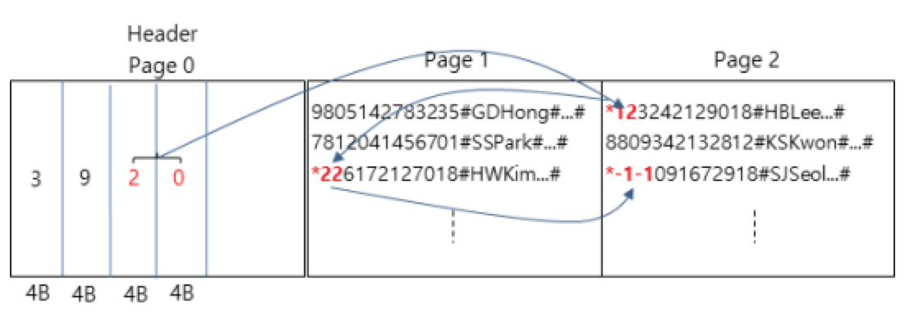

# 과제 5: 레코드 저장 및 삭제

**주의: 프로그램 소스를 그대로 복사를 하거나 살짝 고쳐서 제출하는 경우 관련 학생들 모두 그 과제에 대해 0점 처리합니다. 두 번 이상 적발되는 경우 전체 과제 점수가 0점이며 D 이하의 학점이 부여됩니다.**

# 1. 개요 

Chap6의 레코드 삭제 관리 및 재사용에 관한 프로그램을 작성한다. 아래의 조건을 반드시 준수하여야 한다.

- 파일 I/O 연산은 system call 또는 C 라이브러리만을 사용한다.
제공되는 person.h와 person.c를 이용하여 아래의 (2) (3)의 기능을 완성한다.

## (1) ‘Person’ 레코드 파일의 구조

레코드 파일은 페이지(page) 단위로 저장되며 여러 개의 페이지들로 구성된다. 첫 번째 페이지는 헤더(header)의 역할을 수행하며(헤더 페이지), 그 이후 페이지는 ‘Person’ 레코드를 저장하는데 사용된다(데이터 페이지). 페이지 번호는 헤더 페이지부터 0, 1, 2, ...을 부여한다.
헤더 페이지는 세 종류의 정보를 저장하며, 첫 4바이트에는 레코드 파일을 구성하는 전체 페이지 수(헤더 페이지 포함)를, 그 다음 4바이트에는 레코드 파일에 존재하는 모든 레코드(삭제 레코드 포함)의 수를, 그 다음 8바이트에는 페이지 번호와 레코드 번호를 각각 4바이트씩 할당하여 저장한다. 페이지 번호와 레코드 번호는 삭제 레코드 리스트를 관리할 때 사용하며, 항상 가장 최근에 삭제된 레코드를 가리킨다. 페이지 번호와 레코드 번호의 초기값은 각각 –1이며, 삭제 레코드가 더 이상 존재하지 않을 경우에도 각각 –1의 값을 가진다. 헤더 페이지의 두 종류의 데이터는 항상 최신의 정보로 유지해야 한다. 헤더 페이지는 첫 번째 레코드가 저장될 때 처음으로 생성된다.
데이터 페이지에는 ‘Person’ 레코드가 저장되며, 레코드를 저장할 때 페이지에 공간이 부족하면 새로운 데이터 페이지를 할당 받아서 그 레코드를 저장한다 (두 페이지에 걸쳐서 레코드를 저장하지 않는다). 물론, 전체 레코드 파일에 삭제 레코드가 존재하면 삭제 레코드 공간에 우선적으로 저장해야 한다. 그렇지 않으면 맨 마지막 데이터 페이지에 저장한다.
‘Person’ 레코드는 fixed length record 방식으로 저장되며, 각 필드는 구분자(delimiter) 방식으로 서로 구분한다. 레코드를 하나 저장할 때마다 데이터 페이지에 RECORD_SIZE(=100B)만큼의 공간이 할당되며, 이 공간의 맨 앞쪽부터 데이터를 저장해 나간다. 구분자는 #를 사용한다. 어떤 경우에는 할당된 RECORD_SIZE의 공간을 다 사용하지 못하는 경우도 있지만, fixed length record 방식이므로 모든 레코드의 공간은 항상 RECORD_SIZE의 크기를 갖는다.
아래 그림의 레코드 파일은 헤더 페이지와 두 개의 데이터 페이지로 구성되어 있으며, 전체 레코드(삭제 레코드 포함)는 9 개, 삭제 레코드는 3 개를 갖고 있다. 삭제 레코드는 linked list로 관리되며, 가장 최근에 삭제된 레코드는 (2, 0)가 가리키는 곳에 위치하며 화살표의 역방향 순서대로 삭제가 이루어졌음을 알 수 있다.



## (2) 레코드 삽입(insert)

터미널에서 person 정보를 입력받고 이를 레코드 파일에 저장한다. 먼저 삭제 레코드가 존재하는지 확인한 후 만약 삭제 레코드가 존재하면 가장 최근에 삭제된 레코드 공간에 새로운 레코드를 저장하며, 그렇지 않은 경우 맨 마지막 데이터 페이지에 append 형식으로 저장한다. 당연히 필요한 경우, 헤더 페이지의 정보와 삭제 레코드 리스트 등을 수정한다. 참고로, 헤더 페이지의 전체 레코드의 수는 정상적인 레코드와 삭제 레코드의 수의 합이다.
삭제 레코드의 공간을 할당할 때 삭제 레코드 리스트에서 가장 최근에 삭제된 레코드를 선택한다.
Person 정보는 6 개의 필드로 구성되며, 사용자는 주민번호, 이름, 나이, 주소, 전화번호, 이메일주소 순서대로 필드값을 입력한다. 필드값은 큰따옴표로 묶어서 입력하며, 필드값은 영문자, 숫자, 특수문자(-, @ 등)만으로 구성된다고 가정한다. 

```sh
a.out i <record file name><field values list>
```

<예시>
```sh
a.out i person.dat “8811032129018” “GD Hong” “23” “Seoul” “02-820-0924” “gdhong@ssu.ac.kr”
```

옵션으로 i를 사용하며 입력받은 필드값을 packing한 후, 즉 8811032129018#GD Hong#23#Seoul#02-820-0924#gdhong@ssu.ac.kr# 형태를 만들어서 이것을 person.dat 레코드 파일에 저장한다. 명령의 수행 후 출력은 없다.

**주의: 나이를 포함한 모든 필드값은 문자열로 레코드에 저장한다. 하지만 헤더 페이지와 삭제 레코드에서의 모든 메타 데이터는 이진 정수(binary integer)로 저장한다.**

## (3) 레코드 삭제(delete)

터미널에서 person 정보 중 주민번호를 입력받고 레코드 파일에서 이것과 일치하는 레코드가 존재하면 해당 레코드를 삭제한다.
삭제 레코드는 Chap6에서 배운 방식대로 관리한다. 삭제 레코드의 첫 번째 바이트는 delete mark *를, 그 다음 4바이트에는 페이지 번호를, 그 다음 4바이트에는 레코드 번호를 저장한다.
페이지 방식으로 레코드를 저장하기 때문에 약간의 수정이 필요하다. Chap6에서는 liked list에서 ‘link’에 해당하는 값으로 바로 직전에 삭제된 레코드 번호를 사용하였으나 이 과제에서는 레코드 번호 대신에 (페이지 번호, 레코드 번호)의 조합을 사용하며, 여기서 페이지 번호는 바로 직전에 삭제된 레코드가 존재하는 페이지를, 레코드 번호는 이 페이지에서의 레코드 번호를 의미한다. 각 데이터 페이지에서의 레코드 번호는 0, 1, 2, ... 순서의 값을 가지며, 모든 데이터 페이지에서의 첫 번째 레코드 번호는 0이다.

```sh
a.out d <record file name> <field value>
```

<예제>
```sh
a.out d person.dat “8811032129018”
```

옵션은 d를 사용하며, person.dat 레코드 파일에서 주민번호 8811032129018과 일치하는 레코드를 찾아서 삭제한다. 명령의 수행 결과에 대한 출력은 없다.

## 2. 개발 환경
- OS: Linux 우분투 버전 18.0.4
- 컴파일러: gcc 7.5
** 반드시 이 환경을 준수해야 하며, 이를 따르지 않아서 발생하는 불이익은 본인이 책임져야 함

## 3. 제출물

- 프로그래밍한 소스파일 person.c를 하위폴더 없이(최상위 위치에) zip파일로 압축하여  myclass.ssu.ac.kr 과제 게시판에 제출한다 (모든 제출 파일들의 파일명은 반드시 소문자로 작성). 제공된 person.h는 제출할 필요가 없음.
- 압축한 파일은 반드시 학번_5.zip (예시 20061084_5.zip)과 같이 작성하며, 여기서 5는 다섯 번째 과제임을 의미함
** 채점 프로그램상 오류가 날 수 있으니 꼭 위 사항을 준수하기 바라며, 이를 따르지 않아서 발행하는 불이익은 본인이 책임져야 함
